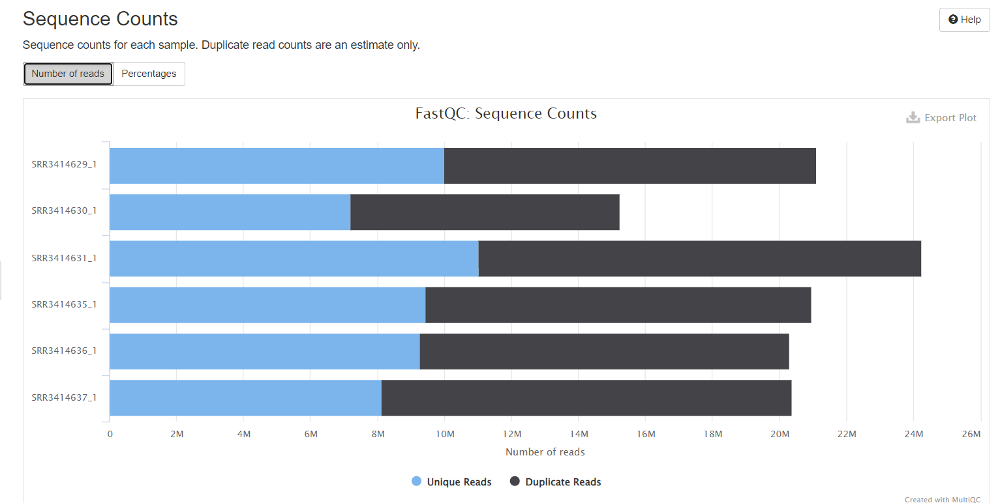

# hse22_hw4
Целью данного задания является сравнение RNA-seq данных перепрограммированных и неперепрограммированных (контрольных) мышиных эмбриональных фибробластов (MEFs) и нахождение генов, которые наиболее сильно изменяют свою экспрессию в этом процессе.
## [Основная часть работы в google colab](https://colab.research.google.com/drive/1t4w27XhR3qSJ25G13S88y68R2_zpcBM5?usp=sharing)
## Проверка чтений, отчёты из из MultiQC
Отчеты bp FastQC по каждому из образцов находятся в папке reports

***

## Картирование всех чтений на геном мыши
Используя программный модуль HISAT, картируем чтения на геном мыши.

Общее количество чтений, которые попали на гены, находим благодаря статистике по каждому из образцов приведённой в файле ALL.counts. Полный файл приведён в разделе data.

## Таблица со статистикой по каждому из 6-ти образцов
| ID образца | Тип образца |  Общее кол-во исходных чтений   |Кол-во и процент чтений,которые были успешно откартированы на геном (уникально)             | Кол-во и процент чтений,которые были успешно откартированы на геном(не уникально)|      Общее кол-во чтений,          которые попали на гены       |
|   :---:        |    :---:      |      :---:        |      :---:        |  :---:            |           :---:               |  
| **SRR3414635** | control       | 20956475          | 18428317 (87.94%) |  1967548 (9.39%)  | 16275997  |
| **SRR3414636** | control       | 20307147          | 17825380 (87.78%) |  1931679 (9.51%)  | 15757580  |    
| **SRR3414637** | control       | 20385570          | 17844858 (87.54%) |  2002433 (9.82%)  | 15736978  |                 
| **SRR3414629** | reprogramming | 21106089          | 18375888 (87.06%) |  2134225 (10.11%) | 16699564  |                  
| **SRR3414630** | reprogramming | 15244711          | 13186139 (86.50%) |  1646541 (10.80%) | 11465324  |                
| **SRR3414631** | reprogramming | 24244069          | 20928945 (86.33%) |  2618741 (10.80%) | 18408851  |    
